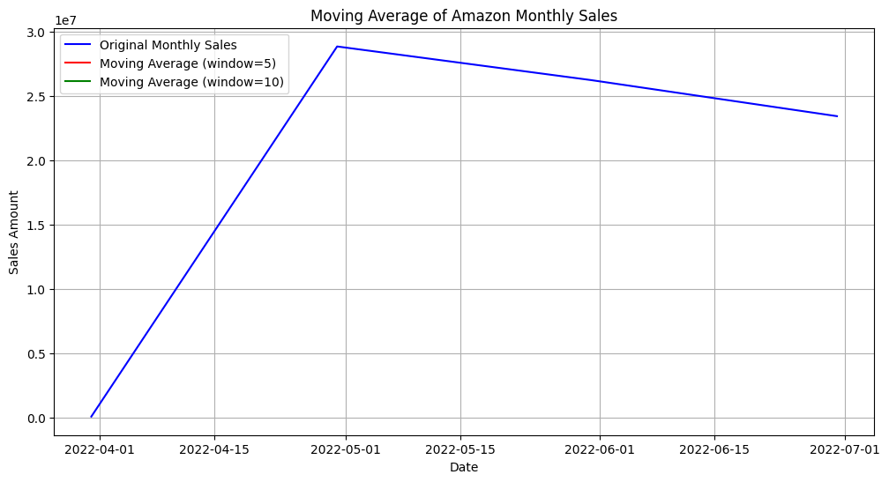
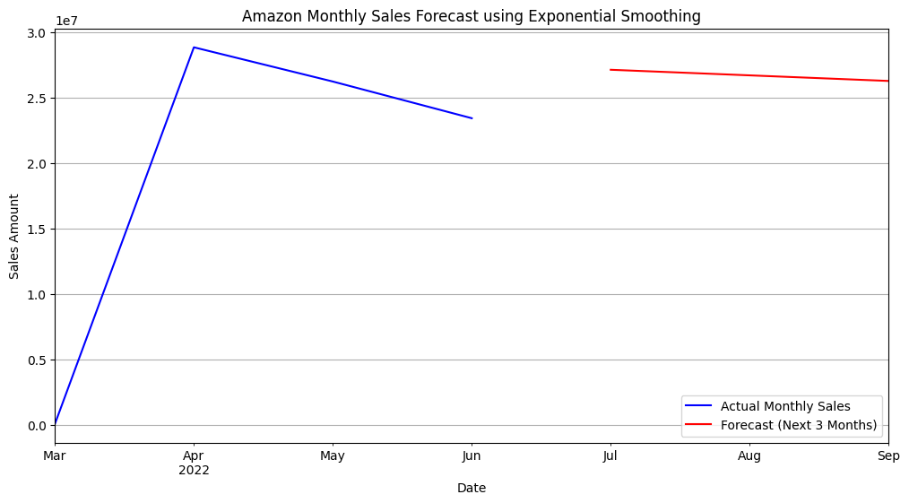
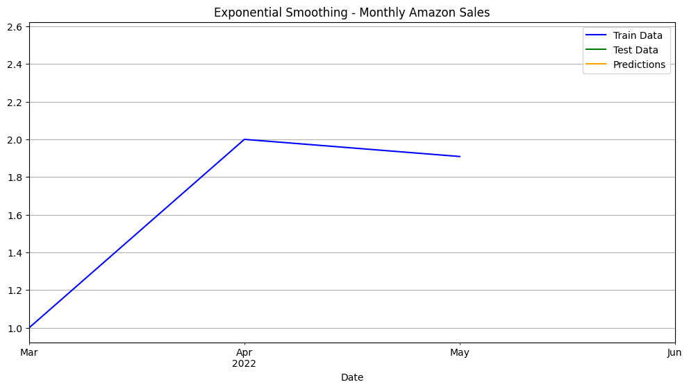

# Ex.No: 08     MOVINTG AVERAGE MODEL AND EXPONENTIAL SMOOTHING
### Date: 


### AIM:
To implement Moving Average Model and Exponential smoothing Using Python.
### ALGORITHM:
1. Import necessary libraries
2. Read the electricity time series data from a CSV file,Display the shape and the first 20 rows of
the dataset
3. Set the figure size for plots
4. Suppress warnings
5. Plot the first 50 values of the 'Value' column
6. Perform rolling average transformation with a window size of 5
7. Display the first 10 values of the rolling mean
8. Perform rolling average transformation with a window size of 10
9. Create a new figure for plotting,Plot the original data and fitted value
10. Show the plot
11. Also perform exponential smoothing and plot the graph
### PROGRAM:
```
# Ex.No: 08 MOVING AVERAGE MODEL AND EXPONENTIAL SMOOTHING
# AIM: To implement Moving Average Model and Exponential Smoothing using monthly Amazon sales data.

# Import necessary libraries
import numpy as np
import pandas as pd
import matplotlib.pyplot as plt
import warnings
from sklearn.preprocessing import MinMaxScaler
from sklearn.metrics import mean_squared_error
from statsmodels.tsa.holtwinters import ExponentialSmoothing

warnings.filterwarnings('ignore')

# ==========================
# STEP 1: READ THE DATASET
# ==========================
data = pd.read_csv("Amazon Sale Report.csv")

# Convert 'Date' column to datetime
data['Date'] = pd.to_datetime(data['Date'])

# Keep only Date and Amount columns
sales_data = data[['Date', 'Amount']]

# Display dataset info
print("Shape of the dataset:", sales_data.shape)
print("\nFirst 10 rows of the dataset:")
print(sales_data.head(10))

# ===================================
# STEP 2: AGGREGATE TO MONTHLY SALES
# ===================================
sales_data.set_index('Date', inplace=True)
monthly_data = sales_data['Amount'].resample('M').sum()  # Sum of sales for each month

print("\nMonthly aggregated data:")
print(monthly_data.head())

# ==================================
# STEP 3: PLOT ORIGINAL MONTHLY DATA
# ==================================
plt.figure(figsize=(12, 6))
plt.plot(monthly_data, label='Monthly Sales', color='blue', linewidth=2)
plt.title('Original Amazon Monthly Sales Data')
plt.xlabel('Date')
plt.ylabel('Total Sales Amount')
plt.legend()
plt.grid()
plt.show()

# ===============================
# STEP 4: MOVING AVERAGE (5 & 10)
# ===============================
rolling_mean_5 = monthly_data.rolling(window=5).mean()
rolling_mean_10 = monthly_data.rolling(window=10).mean()

print("\nFirst 10 values of rolling mean (window=5):")
print(rolling_mean_5.head(10))
print("\nFirst 20 values of rolling mean (window=10):")
print(rolling_mean_10.head(20))

# Plot moving averages
plt.figure(figsize=(12, 6))
plt.plot(monthly_data, label='Original Monthly Sales', color='blue')
plt.plot(rolling_mean_5, label='Moving Average (window=5)', color='red')
plt.plot(rolling_mean_10, label='Moving Average (window=10)', color='green')
plt.title('Moving Average of Amazon Monthly Sales')
plt.xlabel('Date')
plt.ylabel('Sales Amount')
plt.legend()
plt.grid()
plt.show()

# ====================================================
# STEP 5: DATA TRANSFORMATION FOR EXPONENTIAL MODEL
# ====================================================
scaler = MinMaxScaler()
scaled_data = pd.Series(
    scaler.fit_transform(monthly_data.values.reshape(-1, 1)).flatten(),
    index=monthly_data.index
)

# Avoid non-positive values for multiplicative model
scaled_data = scaled_data + 1

# Split into training and testing sets (80/20)
x = int(len(scaled_data) * 0.8)
train_data = scaled_data[:x]
test_data = scaled_data[x:]

# ==========================================
# STEP 6: EXPONENTIAL SMOOTHING (Additive)
# ==========================================
# Since you only have ~5 months of data, seasonal pattern is too short — use additive trend only
model_add = ExponentialSmoothing(train_data, trend='add', seasonal=None).fit()
test_predictions = model_add.forecast(steps=len(test_data))

# Plot actual vs predicted
ax = train_data.plot(figsize=(12, 6), label='Train Data', color='blue')
test_data.plot(ax=ax, label='Test Data', color='green')
test_predictions.plot(ax=ax, label='Predictions', color='orange')
ax.legend()
ax.set_title('Exponential Smoothing - Monthly Amazon Sales')
plt.grid()
plt.show()

# Evaluate model performance
mse = mean_squared_error(test_data, test_predictions)
print("\nMean Squared Error (MSE):", round(mse, 5))
print("Data Variance:", round(np.sqrt(scaled_data.var()), 5))
print("Data Mean:", round(scaled_data.mean(), 5))

# ==========================================
# STEP 7: FORECAST FUTURE (NEXT 3 MONTHS)
# ==========================================
model_final = ExponentialSmoothing(monthly_data, trend='add', seasonal=None).fit()
forecast = model_final.forecast(steps=3)  # Forecast next 3 months

# Plot forecast
ax = monthly_data.plot(figsize=(12, 6), label='Actual Monthly Sales', color='blue')
forecast.plot(ax=ax, label='Forecast (Next 3 Months)', color='red')
ax.set_xlabel('Date')
ax.set_ylabel('Sales Amount')
ax.set_title('Amazon Monthly Sales Forecast using Exponential Smoothing')
ax.legend()
plt.grid()
plt.show()

```
### OUTPUT:

### Moving Average



### Plot Transform Dataset



### Exponential Smoothing



### RESULT:
Thus we have successfully implemented the Moving Average Model and Exponential smoothing using python.
